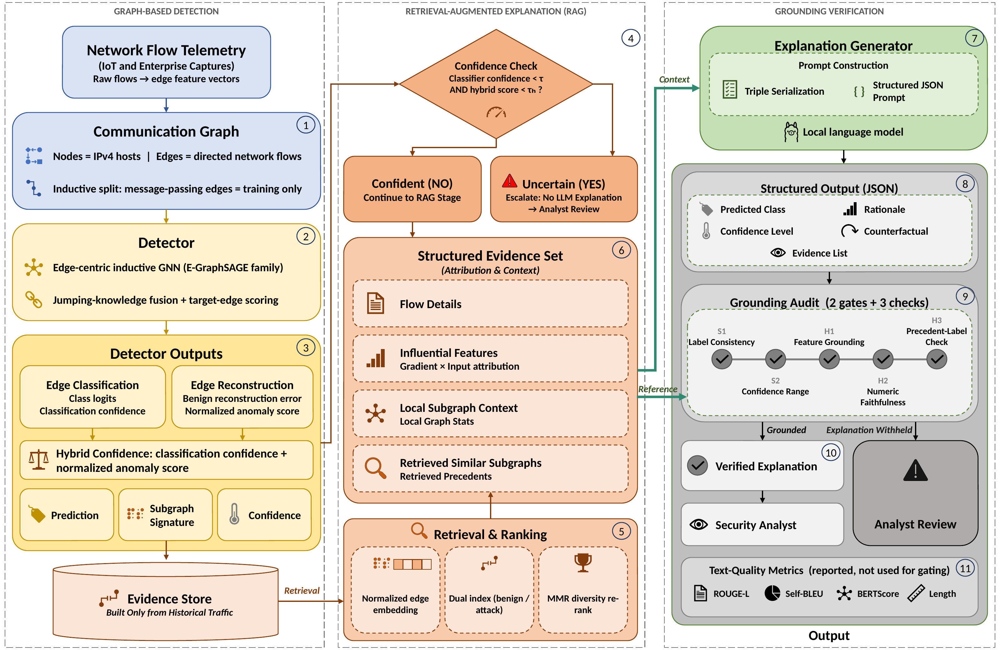

# DOSSIER: Subgraph-Indexed Retrieval and Grounding Verification for Explainable Intrusion Detection

Code and reported results for the article **"Explanations as Claims: Subgraph-Indexed Retrieval and
Grounding Verification for Explainable Intrusion Detection"** (submitted to AI, MDPI).

## Overview

Retrieval-augmented generation is usually motivated by its effect on the quality of generated text.
DOSSIER (**D**ecidable **O**utput **S**creening with **S**ubgraph-**I**ndexed **E**vidence **R**etrieval)
uses a structural consequence of retrieval instead: retrieval returns a finite, enumerable evidence set,
so every entity, value and class label an explanation cites has a referent known at generation time.
Grounding verification therefore becomes a decision rather than an estimate.

DOSSIER pairs an inductive, edge-centric graph neural network with a locally deployed language model
(`llama3.2:3b` via Ollama). Every generated rationale is audited before display; explanations that fail
the audit or cannot be parsed are withheld and escalated to an analyst, as are low-confidence predictions.



## Approach

1. **Graph construction.** Hosts are nodes and NetFlow records are directed edges of a multigraph.
   Edges are split 70/10/20 (stratified); message passing uses training edges only (inductive setting).
   Node features are degree statistics and per-node means/standard deviations of four edge attributes,
   computed from training edges.
2. **Detector.** Three edge-conditioned message-passing layers with jumping-knowledge fusion produce the
   edge descriptor `z_uv = [h_u, h_v, h_u − h_v, h_u ⊙ h_v, e_uv]`. A reconstruction branch, trained on
   benign edges, supplies a standardised anomaly score to the classifier through a learned gate.
   Training uses a class-balanced focal loss plus a ramped reconstruction loss.
3. **Confidence-based escalation.** A flow is escalated without an explanation when classifier
   confidence `c < τ = 0.65` **and** the triage score `h = 0.7·c + 0.3·σ(ε̃) < τ_h = 0.60`.
4. **Graph-contextual retrieval.** A projection of `z_uv` gives an L2-normalised 128-d key. Separate
   FAISS inner-product indices hold training attack flows and up to 200,000 training benign flows;
   candidates are re-ranked with Maximal Marginal Relevance.
5. **Triple-serialised evidence.** Flow attributes, Gradient × Input attributions, local subgraph
   statistics and retrieved precedents are serialised as subject–predicate–object triples. The same
   evidence conditions the LLM and serves as the reference for verification.
6. **Grounding audit.** Two schema gates (S1 label consistency, S2 confidence range) and three content
   checks (H1 feature grounding, H2 numeric faithfulness, H3 precedent-label consistency). Text-quality
   metrics (ROUGE-L, BERTScore-F1, Self-BLEU, length) are reported but not used for gating.

## Repository structure

```
DOSSIER/
├── README.md
├── CITATION.cff
├── requirements.txt
├── .gitignore
├── notebooks/                              # full pipeline, one notebook per dataset (saved outputs = reported runs)
│   ├── dossier_nf_ton_iot_v2.ipynb
│   ├── dossier_nf_ton_iot_v3.ipynb
│   └── dossier_nf_cse_cic_ids2018_v2.ipynb
├── ablations/                              # ablation studies (saved outputs = reported runs)
│   ├── ablation_nf_ton_iot_v2.ipynb        # Table 10, Table 17 (v2 row)
│   ├── ablation_nf_ton_iot_v3.ipynb        # Tables 9 and 10, Table 17 (v3 row), Figure 10
│   └── ablation_nf_cse_cic_ids2018_v2.ipynb  # Table 10, Table 17 (CSE row)
├── results/                                # artifacts written by the reported main runs
│   ├── README.md
│   ├── nf_ton_iot_v2/
│   ├── nf_ton_iot_v3/
│   └── nf_cse_cic_ids2018_v2/
├── figures/
│   ├── dossier_framework.png / .pdf        # paper Figure 1
│   └── dossier_framework.pptx              # editable source
└── data/
    └── README.md                           # dataset files expected by the notebooks
```

Each notebook is self-contained; the code is kept in notebook form exactly as it produced the reported
results.

## Installation

Tested environment for the reported results: Python 3.12.9, PyTorch 2.5.1 (CUDA 12.1), NVIDIA Quadro
RTX 8000 (48 GB).

```bash
git clone https://github.com/<user>/DOSSIER.git
cd DOSSIER
python3.12 -m venv .venv
source .venv/bin/activate

# PyTorch build for your platform (CUDA 12.1 shown)
pip install torch==2.5.1 --index-url https://download.pytorch.org/whl/cu121
pip install -r requirements.txt
```

The explanation stage needs a local [Ollama](https://ollama.com) server:

```bash
ollama pull llama3.2:3b
ollama serve            # listens on http://localhost:11434
```

BERTScore downloads `distilbert-base-uncased` from the Hugging Face Hub on first use.

## Dataset preparation

The datasets are not included. Place the three class-aware downsampled CSV files in `data/`:

```
data/NF-ToN-IoT-v2_targetCounts.csv
data/NF-ToN-IoT-v3_targetCounts.csv
data/CSE_v2_targetCounts.csv
```

or point `DOSSIER_DATA_DIR` to another directory. `data/README.md` lists the expected row counts,
columns, class distribution (paper Table 3), the links to the original University of Queensland
releases, and the SHA-256 checksums of the files used to prepare this repository.

## Running the main experiments

Run a notebook from inside `notebooks/` (relative paths assume this working directory). Executing a
notebook overwrites its saved outputs, so write to a new file to keep the reported outputs intact:

```bash
cd notebooks
jupyter nbconvert --to notebook --execute --ExecutePreprocessor.timeout=-1 \
    dossier_nf_ton_iot_v3.ipynb --output dossier_nf_ton_iot_v3_rerun.ipynb
```

Outputs (checkpoint, figures, CSV/JSON/Markdown reports) are written to `outputs/<dataset>/`
(override with `DOSSIER_OUTPUT_DIR`). Each main notebook trains the seed-42 model, evaluates it,
computes attribution faithfulness, runs the audited LLM explanation stage on up to 10 flows per attack
class, and retrains five seeds for robustness. Measured wall-clock times on the reference GPU were
4 h 18 min (v2), 4 h 32 min (v3) and 11 h 42 min (CSE), dominated by the five-seed evaluation (Table 18).

## Running the ablation studies

Run the main notebook for the same dataset first, then:

```bash
cd ablations
jupyter nbconvert --to notebook --execute --ExecutePreprocessor.timeout=-1 \
    ablation_nf_ton_iot_v3.ipynb --output ablation_nf_ton_iot_v3_rerun.ipynb
```

An ablation notebook re-runs the shared pipeline and **loads** `outputs/<dataset>/rag_ids_v4_seed42.pt`
when present (otherwise it trains one), then runs:

- **Table 10** (all datasets): full model, w/o gated reconstruction, w/o jumping-knowledge,
  re-implemented E-GraphSAGE (seed 42, identical splits).
- **Table 17** (all datasets): faithfulness summary, including the share of flows with a deletion drop
  below 0.05.
- **Table 9** (NF-ToN-IoT-v3 only): temporal-attribution audit with all 51 features, and retraining with
  the two absolute timestamp columns removed (49 features).

Printed labels in the saved ablation outputs follow an earlier draft of the manuscript:
printed "Table 8" = paper Table 9, "Table 9" = Table 10, "Table 16" = Table 17.

## Main results reported in the paper

**Detection, test set, five seeds (Table 5).**

| Dataset | Accuracy | Macro-F1 | Weighted-F1 |
|---|---|---|---|
| NF-ToN-IoT-v2 | 0.9736 ± 0.0004 | 0.9262 ± 0.0005 | 0.9731 ± 0.0004 |
| NF-ToN-IoT-v3 | 0.9662 ± 0.0025 | 0.9802 ± 0.0011 | 0.9664 ± 0.0024 |
| NF-CSE-CIC-IDS2018-v2 | 0.9924 ± 0.0003 | 0.8393 ± 0.0034 | 0.9925 ± 0.0003 |

**Explanation pipeline (Table 13).** `hall_parsed`: mean content-hallucination score over parsed
explanations; `hall_all`: over all LLM calls with parse failures scored 1.0.

| Dataset | Sampled | Escalated | LLM calls | Valid JSON | hall_parsed | hall_all |
|---|---:|---:|---:|---:|---:|---:|
| NF-ToN-IoT-v2 | 90 | 14 (15.6%) | 76 | 71 (93.4%) | 0.038 | 0.101 |
| NF-ToN-IoT-v3 | 90 | 4 (4.4%) | 86 | 73 (84.9%) | 0.064 | 0.205 |
| NF-CSE-CIC-IDS2018-v2 | 140 | 32 (22.9%) | 108 | 83 (76.9%) | 0.108 | 0.315 |

**Audit pass rates over parsed explanations (Table 14).**

| Dataset | S1 | S2 | H1 grounded | H2 numeric | H3 precedent |
|---|---:|---:|---:|---:|---:|
| NF-ToN-IoT-v2 | 100.0% | 100.0% | 95.8% | 100.0% | 93.0% |
| NF-ToN-IoT-v3 | 100.0% | 100.0% | 95.9% | 98.6% | 86.3% |
| NF-CSE-CIC-IDS2018-v2 | 100.0% | 100.0% | 97.6% | 98.8% | 71.1% |

**Architectural ablation, macro-F1, seed 42 (Table 10).**

| Variant | NF-ToN-IoT-v2 | NF-ToN-IoT-v3 | NF-CSE-CIC-IDS2018-v2 |
|---|---:|---:|---:|
| E-GraphSAGE (re-implemented) | 0.9263 | 0.9799 | 0.8413 |
| DOSSIER w/o jumping knowledge | 0.9273 | 0.9787 | 0.8381 |
| DOSSIER w/o gated reconstruction | 0.9252 | 0.9805 | 0.8419 |
| DOSSIER (full) | 0.9259 | 0.9802 | 0.8414 |

**Absolute-timestamp ablation on NF-ToN-IoT-v3, seed 42 (Table 9).**

| Configuration | Features | Accuracy | Macro-F1 | Temporal in top-5 |
|---|---:|---:|---:|---:|
| v3, all columns | 51 | 0.9665 | 0.9802 | 74.4% |
| v3, no absolute timestamps | 49 | 0.9283 | 0.9549 | 13.8% |
| v2 (reference) | 41 | 0.9738 | 0.9259 | — |

**Attribution faithfulness, n = 100 test attack flows (Table 17).**

| Dataset | Top-5 deletion drop (mean) | Median | AOPC (mean) | Flows with drop < 0.05 |
|---|---:|---:|---:|---:|
| NF-ToN-IoT-v2 | 0.3898 | 0.3430 | 0.2953 | 25.00% |
| NF-ToN-IoT-v3 | 0.4071 | 0.2454 | 0.3320 | 42.00% |
| NF-CSE-CIC-IDS2018-v2 | 0.3014 | 0.2788 | 0.2233 | 20.00% |

### Where each result comes from

| Paper item | Source |
|---|---|
| Tables 5, 11, 12; Tables 6–8 (per-class, seed 42); Tables 13–15; Table 18 | `notebooks/` (one per dataset) |
| Table 9 | `ablations/ablation_nf_ton_iot_v3.ipynb` (v2 reference row from `notebooks/dossier_nf_ton_iot_v2.ipynb`) |
| Table 10 | `ablations/` (one per dataset) |
| Table 17 | v2 and CSE rows: main and ablation notebooks (identical); v3 row: `ablations/ablation_nf_ton_iot_v3.ipynb` |
| Figures 3–9 (underlying data) | `notebooks/` and `results/`; Figure 10: `ablations/ablation_nf_ton_iot_v3.ipynb` |

## Reproducibility notes

- **Splits and seeds.** Splits, initialisation and sampling use fixed seeds (42 for single runs;
  42, 123, 7, 2024, 999 for robustness). GPU scatter-reduce in message passing is non-deterministic,
  so retraining with the same seed can differ slightly (≤ 0.8 pp macro-F1 observed; paper footnote to Table 6).
- **NF-ToN-IoT-v3 checkpoints.** The v3 ablation notebook loaded a seed-42 checkpoint from a separate
  training run (macro-F1 0.9802, accuracy 0.9665), which underlies Tables 9, 10 and the v3 row of
  Table 17. The main v3 notebook's checkpoint gives macro-F1 0.9800 (Table 6). For v2 and CSE, the
  main and ablation runs give identical seed-42 test metrics.
- **Trained checkpoints** (seed 42, about 3.3 MB each) are not stored in Git. If they are published as
  release assets, copy one to `outputs/<dataset>/rag_ids_v4_seed42.pt` so the ablation notebook loads it.
- **LLM stage.** `llama3.2:3b` via Ollama, temperature 0.1, top-p 0.9, JSON schema stated in the prompt
  without constrained decoding. Outputs are not fully deterministic: the saved ablation notebooks contain
  a second execution of this stage whose figures differ from Tables 13–15 (paper Sec. 11.2).
- **Fallback LLM.** If Ollama is unreachable, `call_llm_structured` falls back to the Anthropic API
  (requires `ANTHROPIC_API_KEY`). All reported explanations were generated by Ollama
  (`llm_source = "ollama"` for every LLM call in `results/*/RAG_IDS_v4_Explanation_Results.json`).
  Keep Ollama running when reproducing the paper.
- **Implementation details visible in the code.** The prompt includes k = 3 retrieved precedents and the
  top-3 attributed features (`build_structured_prompt(fi, k=3, …)`); the deletion test inside the prompt
  uses the same 3 features, while the faithfulness evaluation (Table 17) uses the top 5. The
  reconstruction-error statistics are an EMA over 8,192 randomly sampled training edges per epoch.
  The precedent-label check (`H5_prec_label`, paper H3) matches class names as case-insensitive
  substrings of the rationale and counterfactual.
- **Datasets.** The downsampling script is not included; see `data/README.md`.
- **Runtime.** CPU execution is possible but impractically slow at full scale.

## Citation

```bibtex
@article{driss2026dossier,
  title   = {Explanations as Claims: Subgraph-Indexed Retrieval and Grounding Verification
             for Explainable Intrusion Detection},
  author  = {Driss, Maha and Saidam, Wahaj and Ben Atitallah, Safa and Boulila, Wadii},
  journal = {****},
  year    = {2026},
  note    = {Submitted}
}
```

See also `CITATION.cff`.

## Authors and affiliations

- **Maha Driss**<sup>1,*</sup> — College of Engineering and Advanced Computing, Alfaisal University, Riyadh 11533, Saudi Arabia
- **Wahaj Saidam**<sup>2</sup> — Robotics and Internet of Things Laboratory, Prince Sultan University, Riyadh 12435, Saudi Arabia
- **Safa Ben Atitallah**<sup>2</sup> — Robotics and Internet of Things Laboratory, Prince Sultan University, Riyadh 12435, Saudi Arabia
- **Wadii Boulila**<sup>2</sup> — Robotics and Internet of Things Laboratory, Prince Sultan University, Riyadh 12435, Saudi Arabia

<sup>*</sup> Corresponding author: maha.idriss@riadi.rnu.tn

## Acknowledgments

The authors thank Prince Sultan University for its support.
